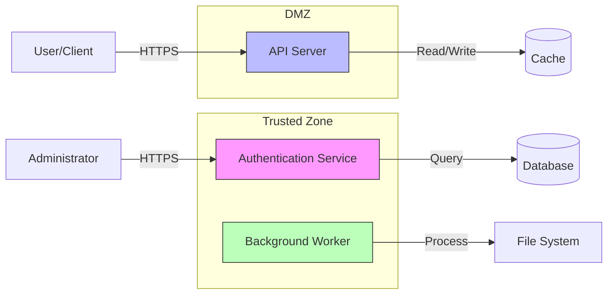

# Threat Model Template

**System/Component:** [Name]  
**Version:** [Version]  
**Date:** [YYYY-MM-DD]  
**Author:** [Name]  
**Reviewers:** [Names]  
**Status:** [Draft/Review/Approved]

---

## 1. System Overview

### Purpose
Brief description of what the system does and its security-critical functions.

### Scope
What is included and excluded from this threat model.

### Deployment Context
- Platform (Linux/Windows/embedded)
- Privilege level (user/root/kernel)
- Network exposure (internet-facing/internal)
- Dependencies and third-party components

## 2. Assets & Trust Boundaries

### Critical Assets

**Data Assets:**
- Cryptographic keys and secrets
- User credentials and authentication tokens
- Sensitive user data (PII, financial, etc.)
- Configuration and policy data
- Audit logs

**System Assets:**
- Authentication mechanisms
- Authorization and access controls
- Cryptographic operations
- Audit and logging systems
- System availability and integrity

### Trust Boundaries

Document boundaries between:
- Processes with different privilege levels
- Network zones (trusted/untrusted)
- User contexts
- Safe/unsafe code boundaries (Rust)
- FFI boundaries between languages

## 3. Data Flow Diagram

**Legend:**
- Rectangles: Processes
- Cylinders: Data stores
- Arrows: Data flows
- Subgraphs: Trust boundaries

## 4. Threat Analysis (STRIDE)

For each component and data flow, document identified threats:

### Component: [Component Name]

#### Spoofing Threats

**Threat ID:** S-[Component]-001  
**Description:** [Detailed threat description]  
**Attack Vector:** [How the attack could be performed]  
**Affected Asset:** [Which asset is at risk]  
**CWE Reference:** [CWE-XXX if applicable]

**DREAD Score:**
- Damage: X/10
- Reproducibility: X/10
- Exploitability: X/10
- Affected Users: X/10
- Discoverability: X/10
- **Total: X.X/10 - [Critical/High/Medium/Low]**

**Mitigation:** [Proposed mitigation strategy]  
**Status:** [Not Mitigated/Partially Mitigated/Mitigated]  
**Residual Risk:** [Remaining risk after mitigation]

---

#### Tampering Threats

**Threat ID:** T-[Component]-001  
[Same structure as above]

---

#### Repudiation Threats

**Threat ID:** R-[Component]-001  
[Same structure as above]

---

#### Information Disclosure Threats

**Threat ID:** I-[Component]-001  
[Same structure as above]

**C++/Rust Specific Considerations:**
- Memory dumps and core dumps
- Debug symbols and stack traces
- Side-channel attacks (timing, cache)
- Uninitialized memory disclosure
- Use-after-free information leaks

---

#### Denial of Service Threats

**Threat ID:** D-[Component]-001  
[Same structure as above]

**C++/Rust Specific Considerations:**
- Null pointer dereferences
- Panics in Rust
- Resource exhaustion (memory, file handles)
- Algorithmic complexity attacks
- Race conditions causing crashes

---

#### Elevation of Privilege Threats

**Threat ID:** E-[Component]-001  
[Same structure as above]

**C++/Rust Specific Considerations:**
- Unsafe code exploitation
- Integer overflows in privilege checks
- Memory corruption leading to code execution
- TOCTOU (Time-of-Check-Time-of-Use) bugs

---

## 5. Risk Summary & Prioritization

### Critical Threats (8.0-10.0)
| Threat ID | Description | DREAD | Status |
|-----------|-------------|-------|--------|
| X-XXX-001 | ...         | 9.2   | Open   |

### High Threats (6.0-7.9)
| Threat ID | Description | DREAD | Status |
|-----------|-------------|-------|--------|
| X-XXX-002 | ...         | 7.4   | Open   |

### Medium Threats (4.0-5.9)
[Similar table]

### Low Threats (1.0-3.9)
[Similar table]

## 6. Mitigation Strategies

### Immediate Actions (Critical/High Threats)

**For Threat ID: X-XXX-001**
- **Mitigation:** [Specific technical approach]
- **Implementation:** [Which components need changes]
- **Timeline:** [Expected completion]
- **Owner:** [Responsible party]
- **Effectiveness:** [Eliminates/Reduces/Detects]
- **Related ADR:** [Link to architecture decision if applicable]

### Planned Mitigations (Medium Threats)
[Same structure]

### Accepted Risks (Low Threats)
Document threats that are accepted without mitigation and justification.

## 7. Security Controls

### Existing Controls
- Authentication: [Description]
- Authorization: [Description]
- Encryption: [In-transit and at-rest]
- Input Validation: [Approaches used]
- Audit Logging: [What is logged]
- Memory Safety: [Smart pointers, RAII, ownership model]
- Code Analysis: [Static analysis, fuzzing, sanitizers]

### Planned Controls
- [Control to be implemented]
- [Control to be implemented]

## 8. Assumptions & Dependencies

### Assumptions
- Attacker capabilities (network access, local access, etc.)
- Trust assumptions about components
- Operating environment assumptions

### Dependencies
- External services and their security posture
- Third-party libraries and their security status
- Platform security features relied upon

## 9. Testing & Validation

### Security Testing Planned
- [ ] Fuzzing with libFuzzer/AFL++/cargo-fuzz
- [ ] Penetration testing
- [ ] Code review with security focus
- [ ] Static analysis (clang-tidy, clippy)
- [ ] Dynamic analysis (ASan, MSan, UBSan, TSan)
- [ ] Vulnerability scanning
- [ ] Threat simulation exercises

### Test Cases for Key Threats
- Threat X-XXX-001: [Test approach]
- Threat X-XXX-002: [Test approach]

## 10. Review & Updates

### Review Schedule
- Initial review: [Date]
- Periodic review: [Frequency]
- Trigger-based review: After significant changes, security incidents, or new vulnerabilities

### Review History
| Date | Reviewer | Changes | Version |
|------|----------|---------|---------|
| YYYY-MM-DD | [Name] | Initial creation | 1.0 |

### Next Review Date
[YYYY-MM-DD]

---

## References

- Related ADRs: [Links]
- Security requirements: [Links]
- Compliance standards: [SOC2, ISO27001, etc.]
- OWASP references: [Specific guides]
- CWE references: [Specific weaknesses]
